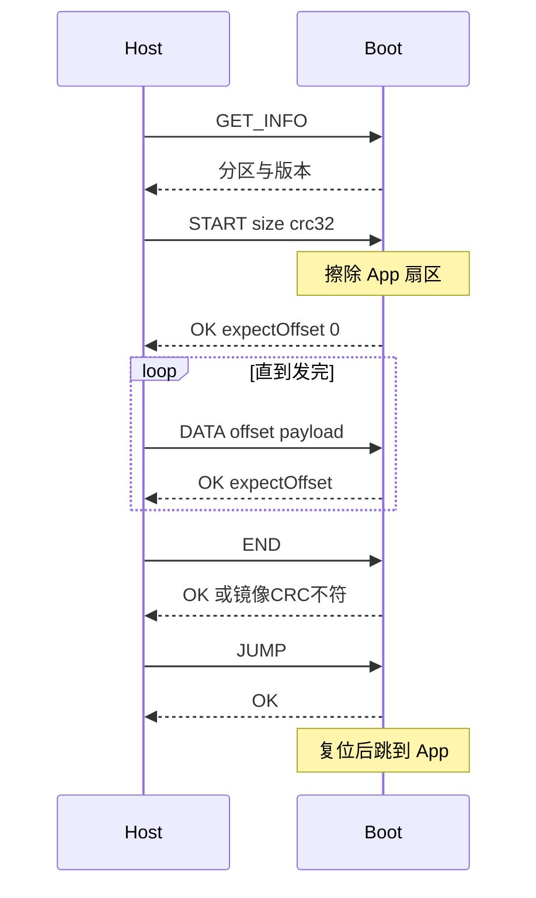

# STM32F4 串口在线升级协议

现有 [doc/通讯协议.xlsx](doc/通讯协议.xlsx) 的「通讯协议总览」只有帧骨架，Sheet2/Sheet3 为空。目标芯片是 STM32F407VETx（512KB Flash）。本阶段只把协议写回该表格，不改 boot 代码。

## 约定

- 字节流协议，与波特率无关。串口建议 115200 8N1，半双工一问一答，设备不主动上报。
- 多字节字段一律小端，与 `uint16_t` / `uint32_t` 一致。
- 按长度切帧，数据区里出现 `0x7E` / `0x6F` 不需要转义。
- 单区覆盖：boot 固定在 Flash 头部，新固件直接写入 App 区。掉电后 boot 仍在，可重新升级。不做 A/B。

Flash 分区（F407 扇区对齐）：

- Boot：`0x08000000`，64KB（扇区 0–3）
- App：`0x08010000`，448KB（扇区 4–7）
- App 链接地址必须是 `0x08010000`，镜像为原始 bin（向量表在文件开头）

## 帧格式

在现有列上补宽度。最小帧 9 字节，数据区单包载荷最大 256 字节。

- 包头 `uint8`：`0x7E`
- 长度 `uint16`：从包头到包尾的总字节数（含包头、长度自身、CRC、包尾）
- 报文序号 `uint16`：请求序号。主机新请求从 1 递增，到 65535 后回到 1；重发保持同一序号。应答序号与请求相同。0 保留不用
- 数据区：`命令 uint8` + 命令载荷
- CRC `uint16`：CRC-16/MODBUS（多项式 `0x8005` 反射，初值 `0xFFFF`，结果异或 `0x0000`）。计算范围按表现有说明：包头 + 长度 + 报文序号 + 数据区，不含 CRC 和包尾。低字节在前
- 包尾 `uint8`：`0x6F`

解析：找到 `0x7E` 后读长度，再读剩余 `长度-3` 字节；末字节必须是 `0x6F`，CRC 不符则丢弃并继续找包头。长度小于 9 或大于 `9+4+256` 视为非法。

## 命令（放在数据区）

应答与请求使用同一命令字，载荷第一个字节是状态码，后面是可选数据。成功状态 `0x00`。

- `0x01` PING：无载荷。应答状态。用于链路测试
- `0x02` GET_INFO：无载荷。应答：`proto_ver uint8=1`，`boot_ver uint16`，`app_base uint32`，`app_max uint32`，`max_payload uint16=256`，`app_valid uint8`，`app_size uint32`，`app_crc32 uint32`
- `0x10` START：`img_size uint32` + `img_crc32 uint32`（CRC-32/ISO-HDLC，覆盖镜像前 `img_size` 字节）。设备擦除 App 中被该长度覆盖到的扇区，擦完后应答，下一包期望偏移为 0。`img_size==0` 或超过 `app_max` 拒绝。升级过程中再次 START 则放弃当前会话并重新擦除
- `0x11` DATA：`offset uint32` + 数据（1..256）。除最后一包外长度必须是 4 的倍数；最后一包写入 Flash 时按字用 `0xFF` 补齐，但 CRC32 只覆盖 `img_size`。偏移必须等于已接收字节数。应答回带 `expect_offset uint32`
- `0x12` END：无载荷。设备按 `img_size` 计算 Flash CRC32 并与 START 中的值比较，同时检查向量表（SP 在 RAM，复位向量在 App 区且 Thumb）。通过后标记 App 有效
- `0x13` ABORT：无载荷。结束会话，不跳转。已擦写的 App 视为无效
- `0x20` JUMP：无载荷。仅当 App 有效时接受。先应答，延时约 50ms，再系统复位；boot 看到有效 App 后跳转

状态码：`0x00` 成功，`0x01` CRC 错，`0x02` 长度错，`0x03` 未知命令，`0x04` 序号错，`0x05` 偏移错（应答里带期望偏移），`0x06` Flash 失败，`0x07` 镜像 CRC 不符，`0x08` 长度超出 App 区，`0x09` 当前没有升级会话，`0x0A` 忙（正在擦除），`0x0B` App 无效不能跳转。

重发：超时后用同一序号重发。若该序号已经成功执行过，设备只重发上一次应答，不重复写 Flash、不重复擦除。

## 升级时序

超时建议：字节间隔 50ms 丢弃本帧；普通应答等待 500ms；START 擦除等待 20s；会话 30s 无有效帧则 ABORT 语义结束，boot 继续等待，不自动跳进半截 App。

## 写入表格

确认后更新 [doc/通讯协议.xlsx](doc/通讯协议.xlsx)：

- 「通讯协议总览」补上每列字节数、端序、长度含义和 CRC 算法
- Sheet2 改为命令与状态码
- Sheet3 改为分区、时序和超时

并删除调研时生成的 [doc/_xlsx_dump.txt](doc/_xlsx_dump.txt)。
